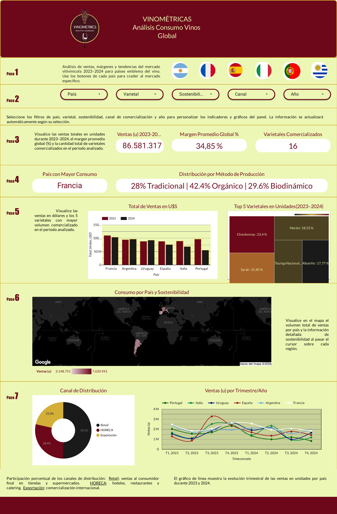

# Vinométricas — Análisis de Consumo de Vino 2023–2024

Dashboard interactivo de Business Intelligence sobre el comportamiento de consumo de vino en seis países productores clave, construido con Google Looker Studio.

**[Ver dashboard interactivo](https://datastudio.google.com/u/0/reporting/2d57f686-5c51-4ef9-9f9b-fdafaebcbd9f/page/p_j8l7d1i9td)**

## Contexto y objetivo

El proyecto surge en el marco de la evaluación de oportunidades para lanzar una nueva presentación de vino en mercados seleccionados. El informe está dirigido al equipo directivo de marketing y desarrollo de producto, con el objetivo de identificar qué varietales tienen mayor aceptación y cómo adaptar la oferta a las preferencias de cada mercado.

Se analiza el comportamiento de consumo de vino durante el período 2023–2024 en:

- Argentina
- Francia
- España
- Italia
- Portugal
- Uruguay

## Qué incluye el análisis

- **Tendencias de consumo interanual** por país (2023 vs. 2024)
- **Desempeño por varietal** más vendido en cada mercado (Malbec, Torrontés, Syrah, Chardonnay, Garnacha, Nebbiolo, Touriga Nacional, Tannat, entre otros)
- **Evolución trimestral de ventas** en unidades, por país
- **Distribución por método de producción**: tradicional, orgánico y biodinámico
- **Canales de comercialización**: Retail, Exportación y HORECA (hoteles, restaurantes, catering)
- **Mapa geográfico interactivo** de volumen de ventas y sostenibilidad

El dashboard permite filtrar dinámicamente por país, varietal, sostenibilidad, canal de comercialización y año, con una página dedicada a cada uno de los seis mercados además de la vista global.

## Principales hallazgos

- El consumo de vino muestra patrones diversos según país y canal de comercialización.
- Se identifican oportunidades para potenciar varietales diferenciales como el **Torrontés**, con estrategias de comunicación basadas en atributos de origen y sostenibilidad.
- Se recomienda priorizar un enfoque segmentado por mercado y reforzar la presencia en los canales de Exportación y HORECA.
- El monitoreo de tendencias interanuales resulta clave para sustentar la planificación comercial futura.

## Fuente de datos y proceso

Los datos de origen provienen de un dataset público de Kaggle. El proceso de trabajo incluyó:

1. **Matriz de datos cruda** (extracción inicial)
2. **Limpieza y normalización** de los datos en Excel y Google Sheets
3. **Modelado y construcción del dashboard** en Looker Studio, con métricas y campos calculados propios

## Herramientas utilizadas

- **Google Looker Studio** (Data Studio) — dashboard interactivo
- **Excel** y **Google Sheets** — limpieza y normalización de datos
- **Kaggle** — fuente del dataset original

## Autora

**Miriam Sivira** — Contadora Pública en formación como Data Analyst / Analista Funcional.

[LinkedIn](https://www.linkedin.com/in/miriam-sivira-hernandez/) · [GitHub](https://github.com/Miri-ai)
